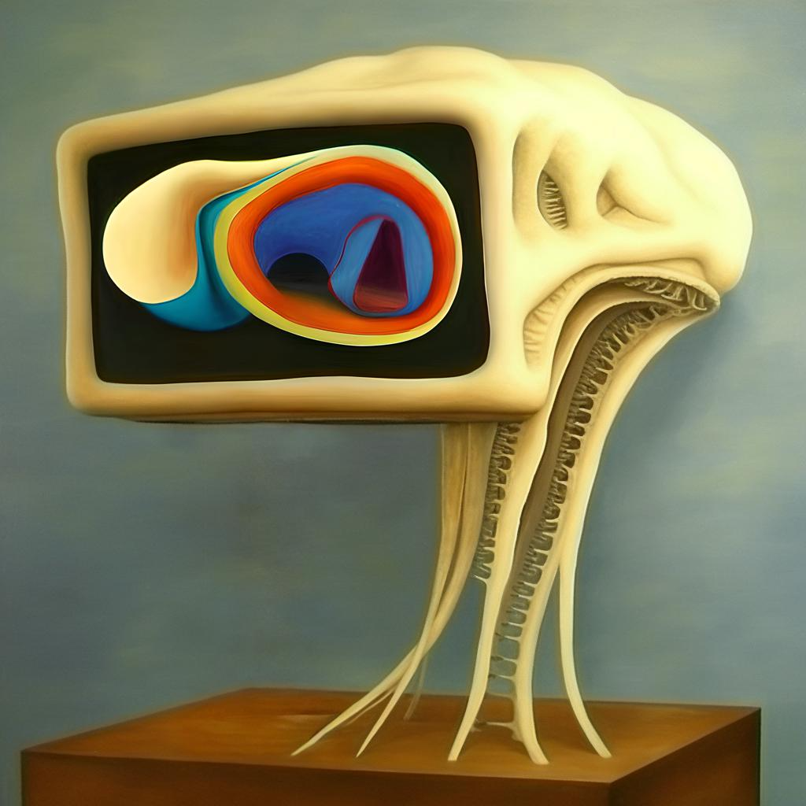

# Deep GUI

<div class="image-container" style="flex: 1; text-align: center">
    
</div>

## Dependencies

```bash
pip install -r requirements.txt
```

### Diffusers

```bash
git clone https://github.com/huggingface/diffusers
cd diffusers
pip install -e .
cd examples/controlnet
pip install -r requirements.txt
```

### Accelerate

Answer questions about your setup:
```bash
accelerate config
```

### HuggingFace

```bash
huggingface-cli login
```

### Wandb
    
```bash
wandb login
```

## Training

Download the [data](https://huggingface.co/datasets/mattlc/deepgui/tree/main) from the HuggingFace Hub.

Run the training script:
```bash
./train.sh
```

## Inference

Download the [model](https://huggingface.co/mattlc/deepgui) from the HuggingFace Hub.

For dependencies, see above.

On your GPU-enabled server, run:
```bash
python server.py \
--server_port SERVER_PORT \
--base_model_path "stabilityai/stable-diffusion-2-1-base" \
--controlnet_path "mattlc/deepgui" \
--control_image_path "conditioning_image.png"
```

On your local machine, run:
```bash
python client.py --server_ip SERVER_IP --server_port SERVER_PORT --output_folder OUTPUT_FOLDER
```

If you know how to make this closer to real-time, you are welcome to contribute!
